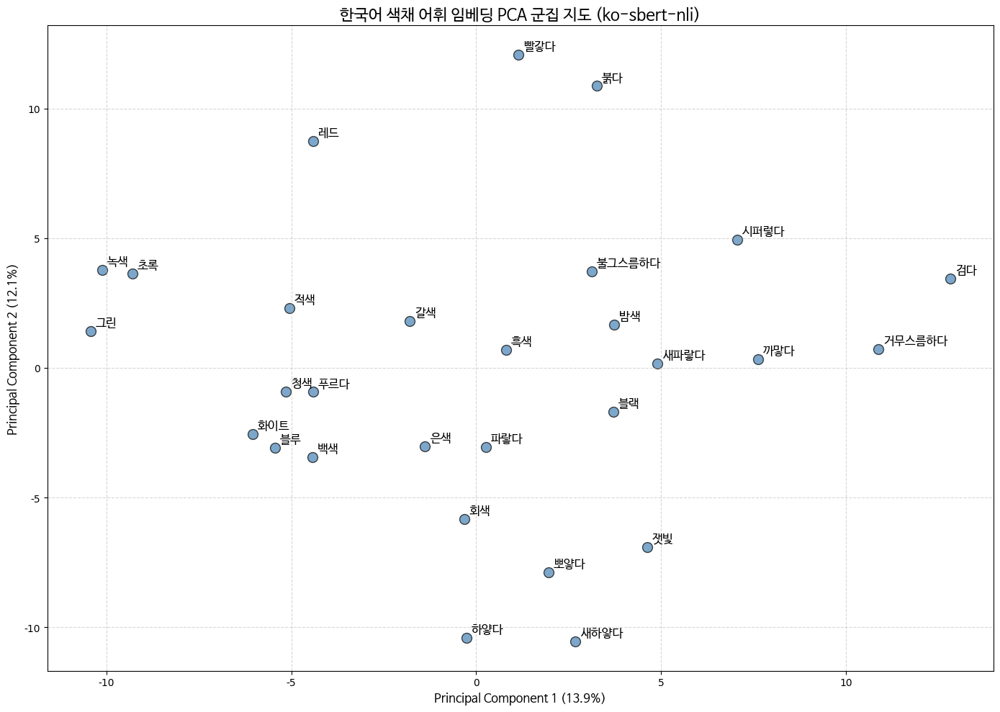

# 🎨 한국어 색채 어휘 임베딩 및 PCA 의미 지형도 시각화

본 저장소는 석사 학위 논문 **"대규모 언어 모델(LLM)의 한국어 색채 어휘 인지 특성 및 의미 구조 분석: 형태론적 변용과 문화적 맥락을 중심으로"** 의 1단계 정량적 분석(Baseline 설정)을 수행하기 위한 소스 코드를 제공합니다.

## 📌 연구 목적 및 코드의 역할
본 연구는 생성형 LLM의 본격적인 화용론적 담화 분석(2단계)에 앞서, 자연어 처리(NLP) 공간에서 한국어 색채 어휘가 어떻게 군집화되는지 객관적인 기준선(Baseline)을 설정하는 것을 목적으로 합니다. 

이 코드는 한국어 특화 임베딩 모델을 활용하여 29개의 통제된 색채 어휘의 고차원 벡터를 추출하고, 주성분 분석(PCA)을 통해 어종 및 형태론적 특성에 따른 2차원 의미 지형도(Semantic Landscape)를 직관적으로 시각화하는 보조적 분석 도구입니다.

## 📊 데이터셋 (Controlled Corpus)
분석에 사용된 데이터는 한국어 표준국어대사전을 기준으로 대표성과 형태 변용 특성이 명확히 구분되는 29개의 핵심 색채 어휘입니다.
* **어종 분류:** 고유어(기본형/변용형), 한자어, 외래어
* **색상 범주:** 흑(Black), 적(Red), 청(Blue), 백(White), 녹(Green), 중성색(Neutral)

## 🛠 분석 환경 및 모델
* **실행 환경:** Google Colab (Python 3)
* **사용 모델:** `snunlp/KR-SBERT-V40K-klueNLI-augSTS`
  * 어휘 간의 형태·의미론적 유사도 측정에 특화된 인코더(Encoder) 기반 모델
* **주요 패키지:** `sentence-transformers`, `scikit-learn` (PCA 차원 축소), `matplotlib` (시각화), `pandas`, `numpy`

## 📈 주요 실행 결과

본 코드를 실행하면 논문 <그림 3-1>에 삽입된 **"한국어 색채 어휘 임베딩 PCA 군집 지도"** 가 산출됩니다. 이를 통해 다음과 같은 정량적 기준선을 확인하였습니다:
1. **한자어 앵커링 현상:** 한자어 색채어가 각 색상 군집의 중심(Anchor)을 형성
2. **외래어의 차원 분리:** 동일 명도를 지칭하더라도 외래어는 다른 차원의 속성으로 임베딩
3. **형태음운론적 군집:** 강조 접사 및 된소리/거센소리 파생에 따른 시각적 강도의 조밀한 벡터화
